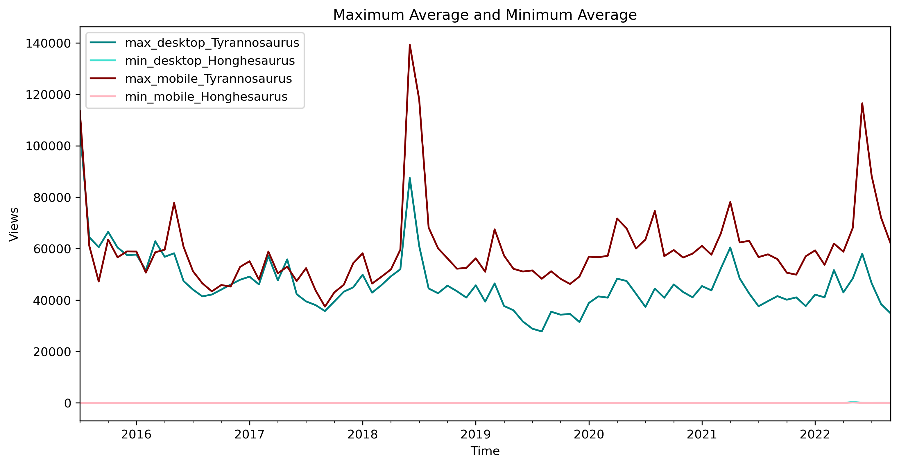

[](https://github.com/nayantaramohan/data-512-homework_1/blob/main/LICENSE)
# DATA 512: Human Centered Data Science (Autumn 2022)

## Homework 1: Professionalism & Reproducibility
## Goal
The goal of this assignment is to construct, analyze, and publish a dataset of monthly article traffic for a select set of pages from English Wikipedia from July 1, 2015 through September 30, 2022. The purpose of the assignment is to develop and follow best practices for open scientific research.

Based on the readings as outlined in [Assessing Reproducibility]([https://www.google.com](http://www.practicereproducibleresearch.org/core-chapters/2-assessment.html)) and [The Basic Reproducible Workflow Template](http://www.practicereproducibleresearch.org/core-chapters/3-basic.html), the best practices for coding and documentation has been incorporated.

## Data sources and API documentation
- [Subset of dinosaur related articles](https://docs.google.com/spreadsheets/d/1zfBNKsuWOFVFTOGK8qnTr2DmHkYK4mAACBKk1sHLt_k/edit?usp=sharing)
- [Pageviews APT documentation](https://wikitech.wikimedia.org/wiki/Analytics/AQS/Pageviews)
- [Pageviews API endpoint](https://wikimedia.org/api/rest_v1/#!/Pageviews_data/get_metrics_pageviews_aggregate_project_access_agent_granularity_start_end)

## Link to licensed sample notebook
- [Sample notebook for API call](https://drive.google.com/file/d/1gtFZAjRoOShsqZKuNhiiSn9Ko4ky-CSC/view?usp=sharing)  
The sample code is under [licensed CC0](https://creativecommons.org/share-your-work/public-domain/cc0/)

## Data files

#### Repository tree
```
.
├── LICENSE
├── README.md
├── data-512-hw1-nmohan.ipynb
├── dino_monthly_cumulative_201507-202209.json
├── dino_monthly_desktop_201507-202209.json
├── dino_monthly_mobile_201507-202209.json
├── dinosaur_genera.cleaned.SEPT.2022.xlsx
├── step2a-minmaxavg-plot.png
├── step2b-top10peak-plot.png
├── step2c-fewest10-plot.png
```

#### Description
- **LICENSE** : a file that contains an MIT LICENSE for nayantaramohan/data-512-homework_1 repo.
- **README.md** : a file that contains information to reproduce the analysis, including data descriptions, attributions and provenance information, and descriptions of all relevant resources and documentation (inside and outside the repo) and hyperlinks to those resources.
- **data-512-hw1-nmohan.ipynb** : clearly documented to indicate what they do, containing code as well as information necessary to understand each processing step.
- **Output data sets** : dino_monthly_cumulative_201507-202209.json, dino_monthly_desktop_201507-202209.json, dino_monthly_mobile_201507-202209.json (described in detail in the .ipynb)
- **Output analysis graphs** : step2a-minmaxavg-plot.png, step2b-top10peak-plot.png, step2c-fewest10-plot.png (described in detail in the .ipynb)
- **Input file** : List of articles were taken from dinosaur_genera.cleaned.SEPT.2022.xlsx  
*No creation of intermediate datasets or outputs*

## Special considerations
- The given [data source](https://docs.google.com/spreadsheets/d/1zfBNKsuWOFVFTOGK8qnTr2DmHkYK4mAACBKk1sHLt_k/edit?usp=sharing), has one modification i.e., the first row input has been modified from *“Coelosaurus” antiquus* to *Coelosaurus antiquus*
- It is possible that certain API calls may not return a valid JSON dump due to lag in the server/client side thus a Try/Except block has been added in the code to take this into account.
- For the cumulative output file, access type of "all-access" is considered and a cumulative monthly sum grouped by each article is calculated.
- A sample output of the JSON file is assumed as below: -  
[
    {
        "project": "en.wikipedia",
        "article": "Aachenosaurus",
        "granularity": "monthly",
        "timestamp": "2015070100",
        "agent": "user",
        "views": 2671
    },
    
## Snapshot of analysis output
 


## Best practices for documentation
- PEP 8 – Style Guide for Python Code ([Reference link](https://peps.python.org/pep-0008/))
- Use of relative path addresses to help in reproducibility
- Use of intuitive variable and function names to ease in understanding
- Appropriate comments and documentation provided for the data aquisition, data processing and data analysis steps
- Description of all data files present in the repository mentioned

## Author
[Nayantara Mohan](https://github.com/nayantaramohan) 

